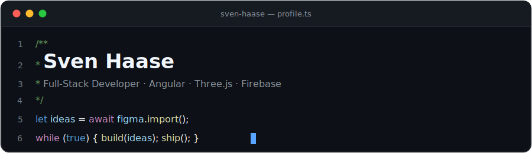

<p align="center">
  <a href="https://svenhaase.de">svenhaase.de</a>&nbsp;&nbsp;·&nbsp;&nbsp;<a href="mailto:info@svenhaase.de">info@svenhaase.de</a>
</p>

## `~/about`

Ich baue Webanwendungen, die sich schnell anfühlen und gut aussehen – am liebsten mit Angular, TypeScript und Firebase, vom Figma-Design bis zum Deployment. Und wenn der Browser mal mehr können soll als Formulare: Three.js, WebGL und Canvas.

> **currently building:** DABubble – Realtime-Chat in Angular mit Threads, Reaktionen & Direktnachrichten

## `~/projects`

| Projekt | Kurz gesagt | Stack |
| :--- | :--- | :--- |
| [**DABubble**](https://dabubble.svenhaase.de) | Slack-artiger Realtime-Chat | Angular · Firebase · SCSS |
| [**Join**](https://join.svenhaase.de) | Kanban-Board mit Drag & Drop | JavaScript · HTML · CSS |
| [**3D Shooter**](https://shooter.svenhaase.de) | Ego-Shooter direkt im Browser | Three.js · WebGL |
| [**El Pollo Loco**](https://el_pollo_loco.svenhaase.de) | Jump'n'Run als Canvas-Game | JavaScript · OOP |
| [**Sauerei**](https://play.google.com/store/apps/details?id=app.sauerei.de) | Android-App im Play Store | Android Studio |
| [**Easy-TV**](https://easy-tv.org) | Community-Forum | phpBB · PHP |

## `~/stack`

```text
frontend    Angular · React · TypeScript · SCSS
backend     Node.js · Firebase · Django · PHP
graphics    Three.js · WebGL · Canvas
tools       Git · Docker · Figma · Android Studio
```

## `~/stats`


---

<p align="center"><sub><i>„Der beste Weg, die Zukunft vorherzusagen, ist, sie zu programmieren."</i></sub></p>
